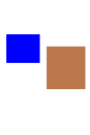

= Welcome to gh pages playground
:toc: left
:icons: font

This static documentation example is hosted on github pages and built with AsciiDoctor.

== Content

include::demo.adoc[]

include::how-to.adoc[]

== Architecture

include::architecture/page.adoc[]

== Various Topics

=== Random2

